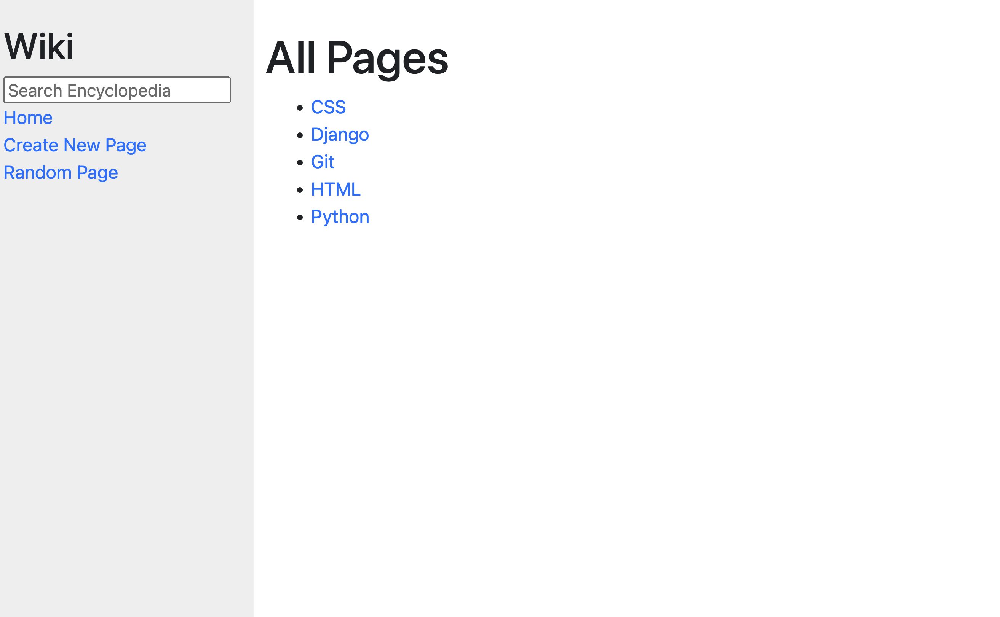

# CS50's Web Programming - Wiki Assignment

This is a Wiki page created as part of The CS50's Web Programming with Python and JavaScript course.  

## Outcomes
- Used Django to implement the page
- Gained a better understanding of how to structure and organize Django projects
- Learned how to convert between markdown and HTML formats
- Used Git and GitHub for overall project management

### Technologies & Resources Used
-  &emsp;  &emsp;  &emsp;  &emsp; &emsp;  

## Specifications 
- [x] Visiting /wiki/TITLE, where TITLE is the title of an encyclopedia entry, should render a page that displays the contents of that encyclopedia entry. The view should get the content of the encyclopedia entry by calling the appropriate util function. 
    - [x] If an entry is requested that does not exist, the user should be presented with an error page indicating that their requested page was not found. If the entry does exist, the user should be presented with a page that displays the content of the entry. The title of the page should include the name of the entry.
- [x] Update index.html such that, instead of merely listing the names of all pages in the encyclopedia, user can click on any entry name to be taken directly to that entry page.
- [x] Allow the user to type a query into the search box in the sidebar to search for an encyclopedia entry. If the query matches the name of an encyclopedia entry, the user should be redirected to that entry’s page.
    - [x] If the query does not match the name of an encyclopedia entry, the user should instead be taken to a search results page that displays a list of all encyclopedia entries that have the query as a substring. For example, if the search query were ytho, then Python should appear in the search results.
    - [x] Clicking on any of the entry names on the search results page should take the user to that entry’s page.
- [x] Clicking “Create New Page” in the sidebar should take the user to a page where they can create a new encyclopedia entry. Users should be able to enter a title for the page and, in a textarea, should be able to enter the Markdown content for the page. Users should be able to click a button to save their new page.
    - [x] When the page is saved, if an encyclopedia entry already exists with the provided title, the user should be presented with an error message. Otherwise, the encyclopedia entry should be saved to disk, and the user should be taken to the new entry’s page.
- [x] On each entry page, the user should be able to click a link to be taken to a page where the user can edit that entry’s Markdown content in a textarea.
    - [x] The textarea should be pre-populated with the existing Markdown content of the page. (i.e., the existing content should be the initial value of the textarea). The user should be able to click a button to save the changes made to the entry. Once the entry is saved, the user should be redirected back to that entry’s page.
- [x] Clicking “Random Page” in the sidebar should take user to a random encyclopedia entry.
- [x] Markdown to HTML Conversion: On each entry’s page, any Markdown content in the entry file should be converted to HTML before being displayed to the user. You may use the python-markdown2 package to perform this conversion, installable via pip3 install markdown2.